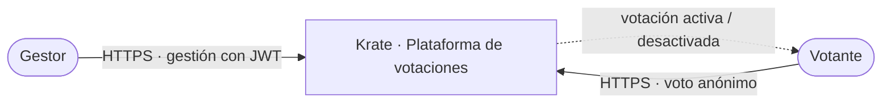
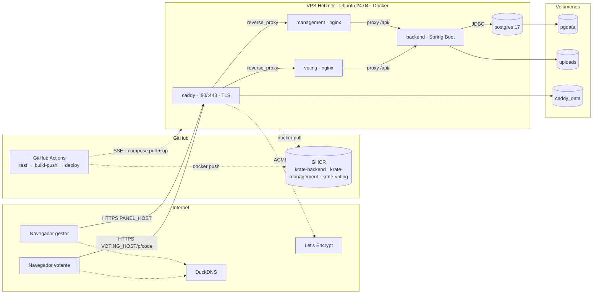
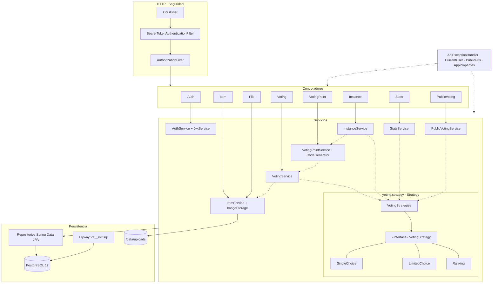
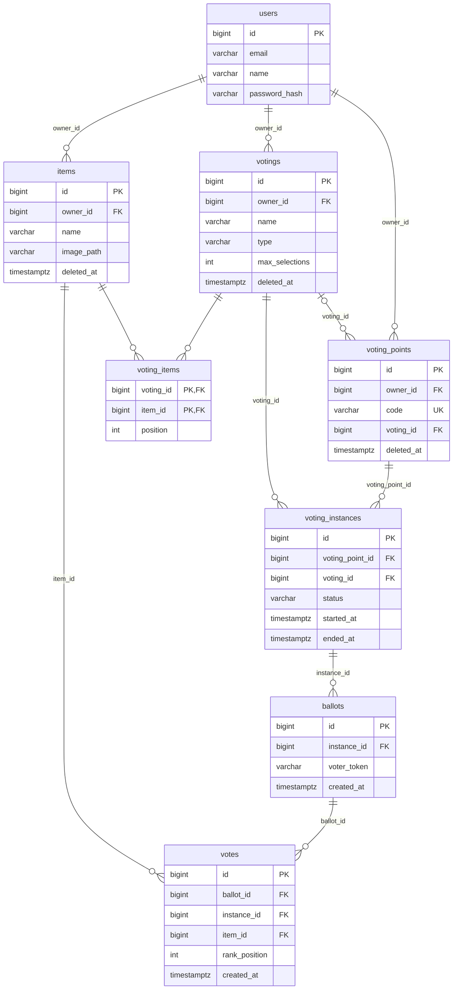
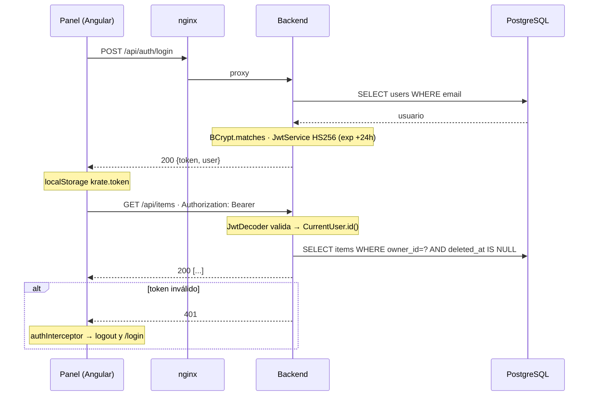
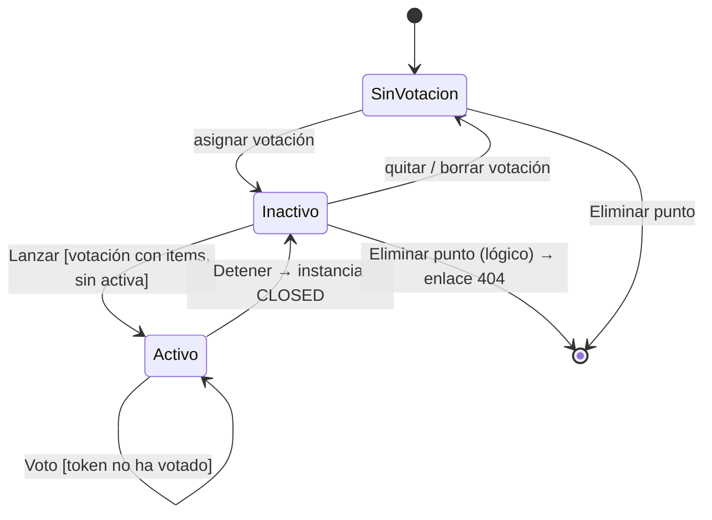
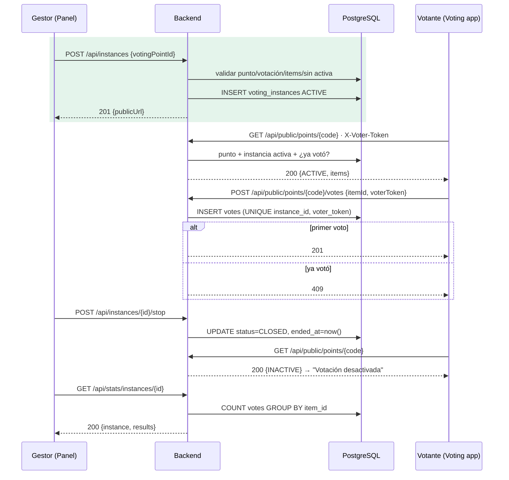
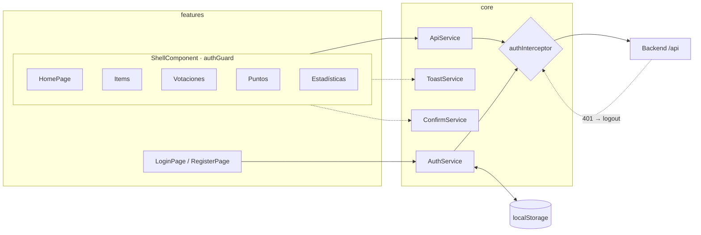
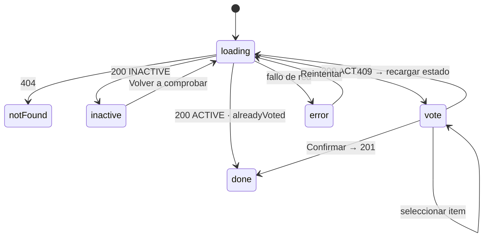

# Arquitectura de Krate

Krate es una plataforma para crear, lanzar y gestionar votaciones en puntos de votación físicos. Este documento describe la arquitectura en dos niveles: primero la **vista de sistema** (qué piezas hay, quién las usa y cómo se despliegan) y después la **vista detallada** (cómo está construida cada pieza por dentro).

Cada diagrama incluye una especificación textual (elementos, conexiones, disposición y colores) pensada para reproducirlo en draw.io, y una versión Mermaid como referencia visual rápida.

---

## Índice

1. [Vista de sistema](#1-vista-de-sistema)
   1. [Contexto: actores y sistema](#11-contexto-actores-y-sistema)
   2. [Contenedores y despliegue](#12-contenedores-y-despliegue)
   3. [Principios de diseño](#13-principios-de-diseño)
2. [Vista detallada](#2-vista-detallada)
   1. [Backend Krate](#21-backend-krate)
   2. [Modelo de datos](#22-modelo-de-datos)
   3. [Seguridad y autenticación](#23-seguridad-y-autenticación)
   4. [Ciclo de vida de una votación](#24-ciclo-de-vida-de-una-votación)
   5. [Frontend de gestión (management-app)](#25-frontend-de-gestión-management-app)
   6. [Frontend de voto (voting-app)](#26-frontend-de-voto-voting-app)
   7. [Reglas de negocio transversales](#27-reglas-de-negocio-transversales)
   8. [Configuración y entornos](#28-configuración-y-entornos)
   9. [Estrategia de pruebas](#29-estrategia-de-pruebas)
3. [Convenciones para los diagramas en draw.io](#3-convenciones-para-los-diagramas-en-drawio)
4. [Patrones de diseño](#4-patrones-de-diseño)
   1. [Patrones aplicados en el código propio](#41-patrones-aplicados-en-el-código-propio)
   2. [Patrones aportados por los frameworks](#42-patrones-aportados-por-los-frameworks)
   3. [Patrones deliberadamente no usados](#43-patrones-deliberadamente-no-usados)

---

## 1. Vista de sistema

### 1.1 Contexto: actores y sistema

Krate tiene dos tipos de usuario con necesidades muy distintas, y por eso se separa en dos interfaces:

| Actor | Qué hace | Cómo accede |
| --- | --- | --- |
| **Gestor** | Crea su cuenta, define items, votaciones y puntos de votación, lanza y detiene votaciones y consulta resultados. | Panel de gestión (web de escritorio), con inicio de sesión. |
| **Votante** | Abre el enlace o código QR de un punto de votación y elige una opción. | Voting app (web móvil), sin registro. |

El sistema no depende de ningún servicio externo: no hay proveedores de identidad, correo ni almacenamiento en la nube. Todo se ejecuta en la propia infraestructura.

#### Diagrama 1 · Contexto del sistema

**Especificación para draw.io**

- Lienzo horizontal. Tres elementos principales alineados en una fila.
- Izquierda: actor **Gestor** (forma *Actor/persona* de la librería UML, o un rectángulo redondeado con icono de usuario). Texto secundario debajo: "Administra votaciones desde el panel".
- Centro: caja grande **Krate · Plataforma de votaciones** (rectángulo redondeado, relleno `#5eba8c`, texto blanco, 320 × 140 px). Dentro, en letra pequeña: "Panel de gestión · Voting app · API REST · PostgreSQL".
- Derecha: actor **Votante**. Texto secundario: "Vota desde el móvil con el enlace del punto".
- Debajo del sistema, una caja gris (`#eceef2`, borde `#dcdfe6`) etiquetada **Sin dependencias externas** con un candado o un tachado sobre "Servicios de terceros".
- Conexiones (flechas con punta abierta, `#5c6472`, grosor 2):
  - Gestor → Krate: "HTTPS · Registro, login y gestión (JWT)".
  - Votante → Krate: "HTTPS · Consulta y envío de voto (anónimo)".
  - Krate → Votante (flecha discontinua de vuelta): "Pantalla de votación activa o desactivada".



### 1.2 Contenedores y despliegue

El sistema se ejecuta como una pila de contenedores Docker definida en `docker-compose.yml`, en la raíz del repositorio. La misma pila sirve para dos entornos:

- **Local**: `docker compose up --build -d` construye las tres imágenes propias y publica los puertos 8081, 8082 y 8080 en el host.
- **Producción**: un VPS (Hetzner CX22, Ubuntu 24.04) ejecuta la pila con el override `docker-compose.prod.yml`, que sustituye `build` por imágenes publicadas en GitHub Container Registry (GHCR), retira la publicación de puertos de los cuatro servicios y añade un quinto contenedor, `caddy`, que es el único alcanzable desde internet y termina TLS para los dos subdominios públicos `<VOTING_HOST>` (voting app, el que va en los QR) y `<PANEL_HOST>` (panel).

Todos los contenedores comparten la red interna que crea Compose.

| Contenedor | Imagen | Puerto host (local) | Puerto host (producción) | Responsabilidad |
| --- | --- | --- | --- | --- |
| `caddy` | caddy:2-alpine | — (no se levanta) | 80 y 443 | Proxy inverso con HTTPS automático (Let's Encrypt). Enruta `<VOTING_HOST>` → `voting:80` y `<PANEL_HOST>` → `management:80`, y redirige HTTP a HTTPS. |
| `management` | nginx 1.27 + build de Angular 22 | 8081 | — (solo red interna) | Sirve la SPA del panel y hace proxy de `/api/` al backend. |
| `voting` | nginx 1.27 + build de Angular 22 | 8082 | — (solo red interna) | Sirve la SPA de voto y hace proxy de `/api/` al backend. |
| `backend` | Eclipse Temurin 21 JRE + jar de Spring Boot 4.1 | 127.0.0.1:8080 | — (solo red interna) | API REST, autenticación, reglas de negocio, imágenes, migraciones. |
| `postgres` | postgres:17 | — (solo red interna) | — (solo red interna) | Persistencia. |

Volúmenes persistentes:

- `pgdata`: datos de PostgreSQL.
- `uploads`: imágenes de los items, montado en `/data/uploads` del backend.
- `caddy_data` y `caddy_config` (solo producción): certificados TLS y estado de Caddy, para que las renovaciones y los reinicios no vuelvan a pedir certificados a Let's Encrypt.

Decisiones clave de este nivel:

- **Los frontends nunca conocen la URL del backend.** Llaman a rutas relativas `/api/...` y es nginx quien las redirige al servicio `backend` de la red de Compose. En desarrollo, el servidor de Angular hace lo mismo mediante `proxy.conf.json`. Así el mismo build sirve para cualquier entorno, incluido producción, donde las imágenes son exactamente las que se probaron en la integración continua.
- **Un único punto de entrada para las imágenes.** El backend las sirve en `/api/files/{nombre}`, y por tanto pasan también por el proxy de nginx. La SPA no necesita conocer rutas de ficheros.
- **El enlace público de un punto de votación** se construye en el backend a partir de la variable `APP_PUBLIC_VOTING_URL`. En producción vale `https://<VOTING_HOST>`, de modo que el panel, servido desde `<PANEL_HOST>`, genera enlaces y códigos QR que apuntan al dominio correcto.
- **Terminación TLS en un solo punto.** Caddy obtiene y renueva los certificados de Let's Encrypt y redirige HTTP a HTTPS; los nginx siguen sirviendo HTTP interno sin cambios en su configuración. HTTPS no es solo una medida de seguridad: `crypto.randomUUID` (identificador del votante) y `navigator.clipboard` (botón de copiar enlace del panel) solo están disponibles en contextos seguros, y en un móvil sin HTTPS la voting app tendría que recurrir a los *fallbacks*.
- **Dos orígenes distintos en producción.** Voting app y panel se sirven en dos subdominios, pero cada uno llama a `/api` relativo a través de su propio nginx, así que el navegador siempre ve un único origen y CORS no interviene. `APP_CORS_ORIGINS` se fija de todos modos a los dos orígenes HTTPS para que la API rechace cualquier otro.
- **Imágenes inmutables desde el registro.** El servidor no compila nada: descarga `ghcr.io/<owner>/krate-backend`, `krate-management` y `krate-voting`, etiquetadas `latest` y `sha-<commit>`. Fijar `IMAGE_TAG` a una etiqueta `sha-...` permite volver a una versión anterior con un `compose up`, sin reconstruir. El VPS tampoco necesita Maven ni Node, lo que reduce su tamaño y su superficie de ataque.
- **Nada expuesto salvo Caddy.** El compose base publica el backend solo en `127.0.0.1:8080`, de modo que ni siquiera un `docker compose up` sin override dejaría la API abierta al exterior; el override de producción retira además los puertos de los nginx.

#### Flujo de despliegue continuo

Cada `push` a `main` (o una ejecución manual) dispara el workflow `.github/workflows/deploy.yml`, con tres trabajos encadenados; si uno falla, los siguientes no se ejecutan y el servidor sigue con la versión anterior.

1. **`test`.** En un *runner* `ubuntu-latest`: Java 21 y `./mvnw -B verify` (los tests de integración levantan PostgreSQL con Testcontainers sobre el Docker del *runner*); Node 22, `npm ci`, `ng build` y `ng test` en `management-app` y `voting-app`. Qué cubre cada uno de estos pasos está en `TESTING.md`.
2. **`build-push`.** Construye las tres imágenes con `docker/build-push-action`, reutilizando caché de capas de GitHub Actions, y las publica en GHCR autenticándose con el `GITHUB_TOKEN` del propio workflow. Cada imagen recibe las etiquetas `latest` y `sha-<commit>`.
3. **`deploy`.** Entra por SSH en el VPS con los secretos del repositorio `DEPLOY_HOST`, `DEPLOY_USER` y `DEPLOY_SSH_KEY` y ejecuta, en `/opt/krate`: `git pull --ff-only` (para recoger cambios en los ficheros de Compose o el `Caddyfile`), `docker compose -f docker-compose.yml -f docker-compose.prod.yml pull`, `... up -d --remove-orphans` y `docker image prune -f`. Compose solo recrea los contenedores cuya imagen ha cambiado; PostgreSQL y Caddy no se reinician en un despliegue normal.

El servidor se preparó una sola vez con `deploy/install-server.sh` (Docker, cortafuegos, usuario de despliegue, clave SSH para Actions, `.env` con los secretos) y desde entonces no requiere intervención manual. Si el repositorio es privado, las imágenes de GHCR también lo son y el servidor hace un único `docker login ghcr.io` con un token de solo lectura (`read:packages`). La guía completa de instalación, operación y apagado está en `deploy/DESPLIEGUE.md`.

#### Diagrama 2 · Contenedores y despliegue

Representa la pila de producción. La pila local es la misma sin `caddy` y con los puertos 8081, 8082 y 127.0.0.1:8080 publicados en el host.

**Especificación para draw.io**

- Lienzo horizontal dividido en cuatro zonas verticales de izquierda a derecha: **Internet**, **GitHub**, **VPS Hetzner · Ubuntu 24.04 · Docker (red `krate_default`)** y **Volúmenes**. Dibuja las zonas como contenedores (swimlanes) con fondo `#f3f5f8` y título en la parte superior. La zona *GitHub* puede ser estrecha y situarse arriba, entre *Internet* y el VPS.
- Zona *Internet*: dos iconos de navegador. Arriba **Navegador del gestor** (escritorio), abajo **Navegador del votante** (móvil). Debajo de ambos, un rectángulo neutro pequeño **DuckDNS** con el texto "`<PANEL_HOST>`, `<VOTING_HOST>` → IP del VPS", y otro **Let's Encrypt**.
- Zona *GitHub*: dos rectángulos neutros apilados: **GitHub Actions** ("test → build-push → deploy") y **GHCR** ("ghcr.io/<owner>/krate-backend · krate-management · krate-voting · `latest`, `sha-<commit>`").
- Zona *VPS*: cinco rectángulos redondeados con borde `#5c6472` y relleno blanco, cada uno con nombre en negrita y dos líneas de detalle:
  - `caddy` — "Caddy 2 · TLS automático" — "host :80/:443 → :80/:443". Pegado al borde izquierdo de la zona, centrado verticalmente. Relleno `#e4f4eb`, porque es el único punto de entrada.
  - `management` — "nginx 1.27 · SPA Angular 22" — "sin puertos publicados". A la derecha de `caddy`, arriba.
  - `voting` — "nginx 1.27 · SPA Angular 22" — "sin puertos publicados". Debajo de `management`.
  - `backend` — "Spring Boot 4.1 · Java 21" — "sin puertos publicados". A la derecha de los dos anteriores, centrado verticalmente entre ellos. Relleno `#e4f4eb` para destacarlo como núcleo.
  - `postgres` — "PostgreSQL 17" — "solo red interna :5432". A la derecha de `backend`. Usa la forma *cilindro* de base de datos.
- Zona *Volúmenes*: tres cilindros grises `#eceef2`: **pgdata**, **uploads (/data/uploads)** y **caddy_data (certificados)**.
- Conexiones (flechas sólidas, punta cerrada):
  - Navegador del gestor → `caddy`: "HTTPS · `<PANEL_HOST>`".
  - Navegador del votante → `caddy`: "HTTPS · `<VOTING_HOST>`/p/{code}".
  - `caddy` → `management`: "reverse_proxy management:80".
  - `caddy` → `voting`: "reverse_proxy voting:80".
  - `management` → `backend`: "proxy /api/ → backend:8080".
  - `voting` → `backend`: "proxy /api/ → backend:8080".
  - `backend` → `postgres`: "JDBC :5432".
  - `backend` → **uploads**: "lee/escribe imágenes".
  - `postgres` → **pgdata**: "datos".
  - `caddy` → **caddy_data**: "certificados".
- Conexiones discontinuas (dependencias y configuración):
  - Navegadores → **DuckDNS**: "resolución DNS".
  - `caddy` ↔ **Let's Encrypt**: "ACME · emisión y renovación".
  - **GitHub Actions** → **GHCR**: "docker push".
  - **GitHub Actions** → zona *VPS* (al borde de la zona): "SSH · compose pull + up -d".
  - Zona *VPS* → **GHCR**: "docker pull".
  - `postgres` → `backend`: "depends_on: service_healthy (pg_isready)".
- Añade una nota amarilla (`#fbf3df`) junto a `caddy`: "deploy/Caddyfile: `{$VOTING_HOST} { reverse_proxy voting:80 }` · `{$PANEL_HOST} { reverse_proxy management:80 }`". Otra junto a `backend`: "Variables: SPRING_DATASOURCE_*, APP_JWT_SECRET, APP_PUBLIC_VOTING_URL=https://<VOTING_HOST>, APP_CORS_ORIGINS, APP_UPLOAD_DIR, APP_SEED_ENABLED=false". Otra junto a los nginx: "`location ^~ /api/` tiene prioridad sobre las reglas de assets estáticos". Y una en el título de la zona VPS: "ufw: solo 22, 80 y 443 · fail2ban en SSH".



---

### 1.3 Principios de diseño

- **Modularidad por responsabilidades.** Tres proyectos independientes (dos Angular, uno Spring Boot) que se comunican solo por la API REST. Cada uno se compila, prueba y despliega por separado.
- **Sin estado en el servidor.** Autenticación con JWT firmado con HMAC; cualquier réplica del backend puede atender cualquier petición.
- **Datos privados por gestor.** Toda entidad de gestión lleva `owner_id` y todas las consultas filtran por el usuario autenticado. Un recurso de otro gestor responde 404, no 403, para no revelar su existencia.
- **Borrado lógico.** Items, votaciones y puntos se marcan con `deleted_at` en lugar de eliminarse, de modo que las estadísticas históricas se conservan íntegras.
- **Integridad garantizada en la base de datos**, no solo en el código: un índice único parcial impide dos instancias activas en el mismo punto, y una restricción única impide que un dispositivo vote dos veces en la misma instancia.
- **Frontends autocontenidos.** Fuente (Nunito) e iconos (lucide-angular) van empaquetados en el build; no hay peticiones a CDN en tiempo de ejecución, lo que permite operar la voting app en redes sin salida a internet.
- **Infraestructura reproducible y desechable.** El servidor de producción se levanta con un script idempotente (`deploy/install-server.sh`), un override de Compose y un workflow de GitHub Actions; no hay nada configurado a mano. Al terminar el periodo de uso se destruye el VPS y se eliminan los subdominios sin dejar rastro, y volver a desplegar en otro servidor es repetir los mismos pasos.

---

## 2. Vista detallada

### 2.1 Backend Krate

Aplicación Spring Boot 4.1.1 sobre Java 21, organizada por **dominios funcionales** (un paquete por concepto de negocio) y no por capas técnicas. Dentro de cada paquete se repite la misma estructura: entidad JPA, repositorio Spring Data, servicio con la lógica y DTOs, y controlador REST.

| Paquete (`com.estinf.Krate.*`) | Contenido | Endpoints |
| --- | --- | --- |
| `config` | `SecurityConfig` (cadena de filtros, CORS, BCrypt), `JwtConfig` (codificador y decodificador Nimbus con clave HMAC), `AppProperties` (propiedades `app.*` tipadas), `OpenApiConfig` (Swagger con esquema Bearer), `DataInitializer` (datos de prueba, solo con `app.seed.enabled=true`: vacía la base de datos y crea el gestor `gestor-test@gmail.com`, 10 items de máquina expendedora, una votación de cada tipo y dos puntos). | — |
| `common` | `ApiExceptionHandler` (errores RFC 9457), excepciones `NotFound`, `Conflict`, `BadRequest`, `CurrentUser` (id del usuario desde el JWT), `PublicUrls` (construye enlaces públicos y URLs de imagen). | — |
| `auth` | `AuthController`, `AuthService` (registro y login con BCrypt), `JwtService` (emisión de tokens). | `POST /api/auth/register`, `POST /api/auth/login`, `GET /api/auth/me` |
| `user` | Entidad `User` y repositorio. | — |
| `item` | `Item`, `ItemService`, `ItemController` (multipart), `ImageStorageService` (guarda en disco con nombre UUID, valida JPG/PNG/WebP), `FileController`. | `GET/POST /api/items`, `GET/PUT/DELETE /api/items/{id}`, `DELETE /api/items/{id}/image`, `GET /api/files/{nombre}` |
| `voting` | `Voting` (lista ordenada de items vía tabla `voting_items`, `type` y `maxSelections`), `VotingService`, `VotingController`. | `GET/POST /api/votings`, `GET/PUT/DELETE /api/votings/{id}` |
| `voting.strategy` | **Patrón Strategy**: `VotingType`, interfaz `VotingStrategy`, implementaciones `SingleChoiceStrategy`, `LimitedChoiceStrategy`, `RankingStrategy`, y el registro `VotingStrategies` que elige la estrategia según el tipo de la votación. | — (lo usan `VotingService`, `InstanceService`, `PublicVotingService` y `StatsService`) |
| `votingpoint` | `VotingPoint`, `CodeGenerator` (código de 8 caracteres sin ambigüedades), `VotingPointService`, `VotingPointController`. | `GET/POST /api/voting-points`, `GET/PUT/DELETE /api/voting-points/{id}` |
| `instance` | `VotingInstance`, `InstanceStatus` (`ACTIVE`, `CLOSED`), `InstanceService` (lanzar y detener), `InstanceMapper`, `InstanceController`. | `GET /api/instances?status=`, `POST /api/instances`, `POST /api/instances/{id}/stop` |
| `vote` | `Ballot` (papeleta: una por dispositivo e instancia) con sus `Vote` (selecciones, con posición en RANKING); `BallotRepository` y `VoteRepository`. | — (lo usa la API pública) |
| `stats` | `StatsService`, `StatsController`: papeletas por instancia y desglose por item calculado por la estrategia del tipo de votación (recuento o puntos Borda), incluyendo items borrados. Sobre la misma función `score` de la estrategia se construyen los resultados agregados de una votación (se concatenan las selecciones de sus lanzamientos y se suman las papeletas, con filtro opcional por punto) y el historial de un item (se puntúa cada lanzamiento en el que fue candidato y se extrae su puesto). Las consultas de papeletas y selecciones se hacen por lotes de instancias para evitar una consulta por lanzamiento. | `GET /api/stats/instances?votingId=&votingPointId=`, `GET /api/stats/instances/{id}`, `GET /api/stats/votings/{id}?votingPointId=`, `GET /api/stats/items/{id}` |
| `publicapi` | `PublicVotingService`, `PublicVotingController`: lo único que consume la voting app. | `GET /api/public/points/{code}`, `POST /api/public/points/{code}/votes` |

Flujo de una petición autenticada:

1. `BearerTokenAuthenticationFilter` (Spring Security) extrae el JWT de la cabecera `Authorization`, lo valida con `NimbusJwtDecoder` (firma HMAC-SHA256 y caducidad) y deja un `Jwt` como principal.
2. El controlador recibe la petición ya validada (`@Valid` sobre los DTOs) y pide el id del usuario a `CurrentUser`, que lo lee del `subject` del token.
3. El servicio ejecuta la lógica dentro de una transacción, siempre filtrando por `ownerId` y `deletedAt IS NULL`.
4. El repositorio Spring Data JPA (Hibernate 7) traduce a SQL sobre PostgreSQL.
5. Cualquier excepción de dominio la convierte `ApiExceptionHandler` en un `ProblemDetail` con el código HTTP adecuado (404, 409, 400, 401, 413) y, en validaciones, un mapa `errors` campo → mensaje.

#### Diagrama 3 · Arquitectura interna del backend

**Especificación para draw.io**

- Lienzo vertical. Cuatro bandas horizontales apiladas (swimlanes con fondo `#f3f5f8`), de arriba abajo: **HTTP / Seguridad**, **Controladores**, **Servicios**, **Persistencia**. A la derecha de todas ellas, una columna estrecha **Transversal**.
- Banda *HTTP / Seguridad*: una cadena de tres cajas unidas por flechas: `CorsFilter` → `BearerTokenAuthenticationFilter (JWT)` → `AuthorizationFilter (permitAll / authenticated)`. Nota al lado: "Rutas públicas: /api/auth/register, /api/auth/login, /api/public/**, /api/files/**, swagger".
- Banda *Controladores*: ocho cajas en fila, relleno blanco, borde `#5eba8c`: `AuthController`, `ItemController`, `FileController`, `VotingController`, `VotingPointController`, `InstanceController`, `StatsController`, `PublicVotingController`. Marca `AuthController` (solo register/login), `FileController` y `PublicVotingController` con una etiqueta pequeña "público".
- Banda *Servicios*: cajas `AuthService` + `JwtService`, `ItemService` + `ImageStorageService`, `VotingService`, `VotingPointService` + `CodeGenerator`, `InstanceService`, `StatsService`, `PublicVotingService`. Flechas verticales desde cada controlador a su servicio. Flechas horizontales discontinuas para dependencias entre servicios: `VotingPointService → VotingService`, `InstanceService → VotingPointService`, `VotingService → ItemService`.
- Banda *Persistencia*: cajas `UserRepository`, `ItemRepository`, `VotingRepository`, `VotingPointRepository`, `VotingInstanceRepository`, `VoteRepository`, todas apuntando a un cilindro **PostgreSQL 17** en el centro inferior. Junto al cilindro, una caja `Flyway · V1__init.sql` con flecha "migra al arrancar".
- Columna *Transversal* (relleno `#e4f4eb`): `ApiExceptionHandler → ProblemDetail`, `CurrentUser`, `PublicUrls`, `AppProperties`. Flechas discontinuas finas desde esta columna hacia las bandas de controladores y servicios.
- Dentro de la banda *Servicios*, a la derecha, un contenedor **voting.strategy (Strategy)** con borde discontinuo `#5eba8c`: una caja interfaz `«interface» VotingStrategy` arriba y tres cajas debajo (`SingleChoiceStrategy`, `LimitedChoiceStrategy`, `RankingStrategy`) unidas a la interfaz con flechas de realización (triángulo hueco). A su lado, la caja `VotingStrategies (registro)`. Flechas discontinuas desde `VotingService`, `InstanceService`, `PublicVotingService` y `StatsService` hacia `VotingStrategies` con la etiqueta "forVoting(voting)".
- Un cilindro pequeño **Disco /data/uploads** a la derecha de la banda de persistencia, con flecha desde `ImageStorageService`.



### 2.2 Modelo de datos

El esquema lo crea Flyway (`V1__init.sql`) y Hibernate lo valida al arrancar (`ddl-auto=validate`): la aplicación no modifica el esquema por su cuenta.

| Tabla | Columnas principales | Notas |
| --- | --- | --- |
| `users` | `id`, `email` (única), `name`, `password_hash`, `created_at` | Cuenta de gestor. Contraseña con BCrypt. |
| `items` | `id`, `owner_id` → users, `name`, `description`, `image_path` (nulo si no hay imagen), `created_at`, `updated_at`, `deleted_at` | `image_path` es solo el nombre del fichero en el volumen. |
| `votings` | `id`, `owner_id` → users, `name`, `description`, `type` (`SINGLE`, `LIMITED`, `RANKING`), `max_selections` (solo LIMITED), `created_at`, `updated_at`, `deleted_at` | El tipo determina la estrategia de validación y puntuación. |
| `voting_items` | `voting_id` → votings, `item_id` → items, `position` | Tabla de unión ordenada; clave primaria compuesta. |
| `voting_points` | `id`, `owner_id` → users, `name`, `description`, `code` (único, 8 caracteres), `voting_id` → votings (nulo), `created_at`, `deleted_at` | El código es el enlace público y no cambia nunca. |
| `voting_instances` | `id`, `voting_point_id` → voting_points, `voting_id` → votings, `status`, `started_at`, `ended_at` | Índice único parcial `(voting_point_id) WHERE status='ACTIVE'`. |
| `ballots` | `id`, `instance_id` → voting_instances, `voter_token`, `created_at` | Una papeleta por dispositivo e instancia: restricción única `(instance_id, voter_token)`. |
| `votes` | `id`, `ballot_id` → ballots, `instance_id` → voting_instances (desnormalizado), `item_id` → items, `rank_position` (1 = mejor, solo RANKING), `created_at` | Una fila por item elegido en la papeleta; restricción única `(ballot_id, item_id)`. |

Todas las claves ajenas son `ON DELETE RESTRICT`: como el borrado es lógico, nunca se ejecuta un `DELETE` físico desde la aplicación y el histórico permanece consistente.

El esquema se construye en dos migraciones: `V1__init.sql` crea el modelo base y `V2__voting_types.sql` añade los tipos de votación y separa papeleta (`ballots`) de selecciones (`votes`), migrando los votos existentes a una papeleta por dispositivo.

Sobre la instancia se guarda `voting_id` además de `voting_point_id`, aunque podría deducirse del punto. Se hace a propósito: si más tarde el gestor asigna otra votación al punto, cada instancia histórica sigue sabiendo qué votación se lanzó.

#### Diagrama 4 · Modelo entidad-relación

**Especificación para draw.io**

- Usa la forma *Entidad* de la librería *Entity Relation* (tabla con cabecera y filas) para cada tabla. Cabecera con relleno `#5eba8c` y texto blanco; filas en blanco. Marca la clave primaria con «PK» y las ajenas con «FK». Sombrea en gris claro las columnas `deleted_at`.
- Disposición en tres filas:
  - Fila superior, centrada: `users`.
  - Fila central, de izquierda a derecha: `items`, `voting_items`, `votings`, `voting_points`.
  - Fila inferior, de izquierda a derecha: `votes`, `ballots`, `voting_instances`.
- Relaciones con notación pata de gallo (líneas `#5c6472`):
  - `users` 1 — N `items`, `votings`, `voting_points` (tres líneas desde `users` hacia abajo, etiqueta "owner_id").
  - `votings` 1 — N `voting_items` N — 1 `items` (la tabla de unión entre ambas, etiqueta "position" en la relación).
  - `votings` 1 — 0..N `voting_points` (etiqueta "voting_id, nulo permitido").
  - `voting_points` 1 — N `voting_instances` (etiqueta "voting_point_id").
  - `votings` 1 — N `voting_instances` (etiqueta "voting_id, copia histórica").
  - `voting_instances` 1 — N `ballots` (etiqueta "instance_id").
  - `ballots` 1 — N `votes` (etiqueta "ballot_id").
  - `voting_instances` 1 — N `votes` (línea discontinua, etiqueta "instance_id, desnormalizado").
  - `items` 1 — N `votes`.
- Dos notas amarillas junto a las restricciones clave:
  - Sobre `voting_instances`: "ÚNICO (voting_point_id) WHERE status = 'ACTIVE' → una sola instancia activa por punto".
  - Sobre `ballots`: "ÚNICO (instance_id, voter_token) → una papeleta por dispositivo e instancia".
  - Sobre `votes`: "ÚNICO (ballot_id, item_id) · rank_position solo en RANKING".
- Leyenda en una esquina: "Todas las FK: ON DELETE RESTRICT · Borrado lógico con deleted_at en items, votings, voting_points".



### 2.3 Seguridad y autenticación

**Gestores.** Registro con correo, nombre y contraseña (mínimo 8 caracteres). La contraseña se guarda con BCrypt. Al registrarse o iniciar sesión, el backend emite un JWT firmado con HMAC-SHA256 usando la clave `APP_JWT_SECRET` (mínimo 32 bytes; la aplicación se niega a arrancar si es más corta). El token contiene `sub` (id de usuario), `email`, `name`, `iat` y `exp` (por defecto 24 horas). El panel lo guarda en `localStorage` y lo envía en cada petición mediante un interceptor HTTP. Si el backend responde 401, el interceptor cierra la sesión y redirige al login.

**Votantes.** No hay cuentas. La voting app genera un identificador aleatorio (`crypto.randomUUID`, con fallback) la primera vez que se abre en un navegador y lo guarda en `localStorage`. Ese `voterToken` viaja en la cabecera `X-Voter-Token` al consultar el punto (para saber si ya votó) y en el cuerpo al enviar la papeleta. La unicidad `(instance_id, voter_token)` en `ballots` impide la doble papeleta aunque dos peticiones lleguen a la vez.

**Autorización de datos.** No hay roles: todos los gestores tienen los mismos permisos sobre sus propios datos. La separación se consigue filtrando por `owner_id` en todas las consultas de gestión.

**CORS.** Ni en Docker local ni en producción interviene, porque cada frontend llama a `/api` a través de su propio nginx y el navegador ve un único origen. En producción `APP_CORS_ORIGINS` se fija de todos modos a `https://<PANEL_HOST>,https://<VOTING_HOST>` para que la API rechace peticiones desde cualquier otro origen; en desarrollo local vale `http://localhost:4200,http://localhost:4300`, ya que los servidores de Angular corren en puertos distintos al backend.

**Transporte y servidor.** En producción todo el tráfico entra por Caddy en HTTPS: obtiene y renueva los certificados de Let's Encrypt, redirige el puerto 80 al 443 y aplica sus valores por defecto de TLS (1.2 o superior). Los nginx propagan `X-Forwarded-For` y `X-Forwarded-Proto` al backend. Ningún otro contenedor publica puertos, y en el sistema operativo `ufw` solo admite 22, 80 y 443 y `fail2ban` bloquea los intentos repetidos de acceso por SSH; el acceso es exclusivamente por clave, con un usuario `krate` sin privilegios de administrador que es el que usa GitHub Actions para desplegar. Los secretos de la aplicación (`APP_JWT_SECRET`, `POSTGRES_PASSWORD`) viven únicamente en el `.env` del servidor, generados con `openssl rand` durante la instalación, y las credenciales que necesita el workflow (host, usuario y clave SSH) están en los *secrets* del repositorio de GitHub, nunca en el código.

#### Diagrama 5 · Secuencia de autenticación del gestor

**Especificación para draw.io**

- Diagrama de secuencia UML con cuatro líneas de vida, de izquierda a derecha: **Panel (Angular)**, **nginx**, **Backend**, **PostgreSQL**.
- Mensajes, en orden:
  1. Panel → nginx: `POST /api/auth/login {email, password}`.
  2. nginx → Backend: reenvío (flecha con etiqueta "proxy").
  3. Backend → PostgreSQL: `SELECT users WHERE email`.
  4. PostgreSQL → Backend: fila de usuario (respuesta discontinua).
  5. Nota sobre Backend: "BCrypt.matches(password, hash)".
  6. Nota sobre Backend: "JwtService: HS256(sub=id, exp=+24h)".
  7. Backend → Panel (respuesta discontinua): `200 {token, user}`.
  8. Nota sobre Panel: "localStorage: krate.token, krate.user".
  9. Panel → Backend: `GET /api/items` con `Authorization: Bearer <token>` (dibuja nginx como paso intermedio o abrevia con una flecha larga).
  10. Nota sobre Backend: "NimbusJwtDecoder valida firma y caducidad → CurrentUser.id()".
  11. Backend → PostgreSQL: `SELECT items WHERE owner_id = ? AND deleted_at IS NULL`.
  12. Backend → Panel: `200 [...]`.
  13. Fragmento alternativo (`alt`) al final: "token caducado o inválido" → Backend responde `401` → nota en Panel: "authInterceptor: logout() y redirección a /login".



### 2.4 Ciclo de vida de una votación

Un **punto de votación** tiene un enlace fijo. Lo que cambia con el tiempo es si hay una **instancia** activa detrás de ese enlace:

| Estado del punto | Qué ve el votante | Cómo se llega |
| --- | --- | --- |
| Sin instancia activa | Pantalla "Votación desactivada" con el nombre del punto y botón de reintentar. | Estado inicial, o tras detener. |
| Instancia `ACTIVE` | Papeleta con los items de la votación; si su dispositivo ya votó, pantalla de agradecimiento. | El gestor pulsa "Lanzar" en Inicio. |
| Instancia `CLOSED` (histórica) | Nada: el votante vuelve a ver "desactivada". La instancia solo existe para estadísticas. | El gestor pulsa "Detener". |

Condiciones para lanzar (`InstanceService.launch`): el punto pertenece al gestor y no está borrado, tiene una votación asignada no borrada, esa votación tiene al menos un item no borrado, y no hay ya una instancia activa en el punto. Si dos gestores pulsan a la vez, el índice único parcial hace fallar la segunda inserción y el manejador de errores lo traduce a 409.

Condiciones para lanzar, además: la configuración de la votación debe ser válida con sus items actuales según su estrategia (por ejemplo, en LIMITED el máximo de votos no puede superar el número de items no borrados).

Condiciones para votar (`PublicVotingService.vote`): el código existe y no está borrado, hay instancia activa, la papeleta es válida según la **estrategia del tipo de votación** (`VotingStrategy.validateBallot`: items distintos y pertenecientes a la votación, exactamente uno en SINGLE, hasta N en LIMITED, al menos uno en RANKING) y el `voterToken` no ha enviado ya una papeleta en esa instancia. La papeleta se guarda como un `Ballot` con un `Vote` por item elegido; en RANKING cada `Vote` lleva su posición.

#### Tipos de votación y estrategia

| Tipo | `validateConfig` | `validateBallot` | `score` | Instrucciones al votante |
| --- | --- | --- | --- | --- |
| `SINGLE` | `maxSelections` debe ser nulo. | Exactamente 1 item. | Papeletas por item; % sobre el total de papeletas. | "Elige una opción y confirma tu voto." |
| `LIMITED` | `maxSelections` obligatorio, entre 2 y el número de items. | De 1 a N items distintos. | Papeletas que incluyen cada item; % sobre el total. | "Elige hasta N opciones y confirma tu voto." |
| `RANKING` | `maxSelections` debe ser nulo. | Al menos 1 item, sin repetir; el orden es la preferencia. | Borda: con M items la posición p vale M − p + 1; además posición media y primeros puestos; % sobre el máximo de puntos posible (papeletas × M). | "Toca las opciones en orden de preferencia, de mejor a peor." |

Los cuatro puntos donde se consulta la estrategia son `VotingService` (crear y editar: `validateConfig`), `InstanceService` (lanzar: `validateConfig` con los items actuales), `PublicVotingService` (consultar: `instructions`; votar: `validateBallot`) y `StatsService` (resultados: `score` y `scoringLabel`). Añadir un cuarto tipo consiste en crear una clase `@Component` que implemente `VotingStrategy` y un valor en `VotingType`; el registro `VotingStrategies` la descubre por inyección y falla al arrancar si falta alguna.

#### Diagrama 6 · Estados de un punto de votación

**Especificación para draw.io**

- Diagrama de estados UML. Punto inicial (círculo negro) a la izquierda.
- Tres estados (rectángulos redondeados):
  - **Sin votación asignada** (relleno `#eceef2`). Transiciones: "asignar votación" → *Inactivo*.
  - **Inactivo · enlace muestra "Votación desactivada"** (relleno blanco). Transiciones: "Lanzar (POST /api/instances) [tiene votación con items y no hay activa]" → *Activo*; "quitar o borrar votación" → *Sin votación asignada*.
  - **Activo · instancia ACTIVE** (relleno `#e4f4eb`, borde `#5eba8c`). Transición: "Detener (POST /api/instances/{id}/stop) → instancia pasa a CLOSED, ended_at = ahora" → *Inactivo*. Transición reflexiva "Voto (POST /api/public/points/{code}/votes)" con guarda "[voterToken no ha votado]".
- Punto final (círculo con borde) desde *Inactivo* o *Sin votación*: "Eliminar punto (borrado lógico) → el enlace responde 404".
- Nota: "Mientras está Activo se bloquean (409): borrar el punto, cambiarle la votación, borrar la votación, cambiar sus items, borrar sus items."



#### Diagrama 7 · Secuencia de lanzamiento y voto

**Especificación para draw.io**

- Diagrama de secuencia con cinco líneas de vida: **Gestor (Panel)**, **Backend**, **PostgreSQL**, **Votante (Voting app)**. Puedes omitir nginx para no recargarlo; añade una nota "todas las llamadas pasan por el proxy nginx".
- Bloque 1, título "Lanzar":
  1. Panel → Backend: `POST /api/instances {votingPointId}` (Bearer).
  2. Backend → PostgreSQL: comprobar punto, votación, items y ausencia de activa.
  3. Backend → PostgreSQL: `INSERT voting_instances (status='ACTIVE')`.
  4. Nota: "índice único parcial protege contra carreras → 409".
  5. Backend → Panel: `201 InstanceResponse {publicUrl}`.
- Bloque 2, título "Votar":
  6. Voting app → Backend: `GET /api/public/points/{code}` con `X-Voter-Token`.
  7. Backend → PostgreSQL: punto por código + instancia activa + ¿existe voto del token?
  8. Backend → Voting app: `200 {status: ACTIVE, alreadyVoted: false, voting: {items}}`.
  9. Voting app → Backend: `POST /api/public/points/{code}/votes {itemId, voterToken}`.
  10. Backend → PostgreSQL: `INSERT votes`.
  11. Backend → Voting app: `201`. Fragmento `alt`: "ya votó" → `409` → la app recarga el estado y muestra agradecimiento.
- Bloque 3, título "Detener":
  12. Panel → Backend: `POST /api/instances/{id}/stop`.
  13. Backend → PostgreSQL: `UPDATE status='CLOSED', ended_at=now()`.
  14. Votante recarga → `GET /api/public/points/{code}` → `200 {status: INACTIVE}` → pantalla "Votación desactivada".
- Bloque 4, título "Consultar resultados": Panel → Backend `GET /api/stats/instances/{id}` → Backend agrupa `votes` por `item_id` (incluye items borrados) → `200 {instance, results[]}`.



### 2.5 Frontend de gestión (management-app)

Aplicación Angular 22 con componentes *standalone*, señales (`signal`, `computed`) para el estado local y rutas cargadas de forma diferida (`loadComponent`). No usa NgModules ni librerías de componentes; los estilos son CSS propio con variables de diseño en `styles.css`.

Estructura:

```
src/app/
  core/       Servicios sin UI y modelos
    auth.service.ts       token y usuario en señales + localStorage; login/register/logout
    auth.interceptor.ts   añade Authorization: Bearer y cierra sesión en 401
    auth.guard.ts         authGuard (exige sesión) y guestGuard (login/registro solo sin sesión)
    api.service.ts        cliente tipado de todos los endpoints de gestión
    toast.service.ts      notificaciones globales
    confirm.service.ts    diálogo de confirmación basado en promesas
    errors.ts             traduce ProblemDetail a mensaje + errores por campo
    models.ts             interfaces espejo de los DTOs del backend
  shared/     Componentes reutilizables sin lógica de negocio
    icons.ts, toast, confirm-dialog, page-header, empty-state, copy-button, loading, results-list (clasificación con barras)
  features/   Una carpeta por sección del dashboard
    auth/           login.page, register.page, auth-layout
    dashboard/      shell (menú lateral + outlet), home.page (lanzar / detener)
    items/          items-list.page, item-form.page (multipart con vista previa)
    votings/        votings-list.page, voting-form.page (selección y orden de items)
    voting-points/  points-list.page, point-form.page
    stats/          stats-list.page (filtros por punto y votación), stats-detail.page (refresco cada 5 s si está activa),
                    voting-stats.page (suma de lanzamientos de una votación, selector de punto), item-history.page (historial de un item)
```

Rutas:

| Ruta | Guard | Componente |
| --- | --- | --- |
| `/login`, `/register` | `guestGuard` | páginas de autenticación |
| `/` | `authGuard` | `ShellComponent` con hijos: `''` Inicio, `votaciones`, `votaciones/nueva`, `votaciones/:id`, `items`, `items/nuevo`, `items/:id`, `puntos`, `puntos/nuevo`, `puntos/:id`, `estadisticas`, `estadisticas/:id` |
| `**` | — | redirige a `/` |

Patrones que se repiten en todas las páginas:

- Las páginas de lista cargan datos en el constructor, muestran `app-loading` mientras tanto y `app-empty-state` si no hay resultados; las acciones destructivas pasan por `ConfirmService.ask()`.
- Las páginas de formulario reciben `id` como *input* de ruta (`withComponentInputBinding`), cargan la entidad en `ngOnInit` si existe, usan formularios reactivos y muestran tanto errores de validación local como los que devuelve el backend en `errors`.
- Los errores HTTP se convierten con `describeError()` y se muestran como toast o como aviso en el formulario.

#### Diagrama 8 · Estructura y flujo de datos del panel

**Especificación para draw.io**

- Lienzo horizontal. Tres columnas: **features (páginas)**, **core (servicios)**, **backend**.
- Columna izquierda: un contenedor grande **ShellComponent** (borde `#5eba8c`) que engloba seis cajas: `HomePage`, `ItemsListPage / ItemFormPage`, `VotingsListPage / VotingFormPage`, `PointsListPage / PointFormPage`, `StatsListPage / StatsDetailPage / VotingStatsPage / ItemHistoryPage`. Fuera del contenedor, arriba: `LoginPage`, `RegisterPage`. Junto al contenedor, una etiqueta "authGuard"; junto a las páginas de auth, "guestGuard".
- Columna central: cajas `ApiService`, `AuthService`, `ToastService`, `ConfirmService`, `authInterceptor` (esta última con forma de rombo o hexágono para indicar que intercepta).
- Columna derecha: caja `Backend /api/*`.
- Conexiones:
  - Todas las páginas del shell → `ApiService` (una flecha agrupada).
  - `LoginPage`, `RegisterPage` → `AuthService`.
  - `ApiService` y `AuthService` → `authInterceptor` → `Backend` con etiqueta "Authorization: Bearer".
  - `Backend` → `authInterceptor` (flecha de vuelta discontinua) con etiqueta "401 → AuthService.logout()".
  - `AuthService` ↔ un cilindro pequeño **localStorage** (`krate.token`, `krate.user`).
  - Páginas → `ToastService` y `ConfirmService` con flechas finas grises.
- Nota: "Componentes standalone · señales · rutas lazy · CSS propio · lucide-angular · Nunito empaquetada".



### 2.6 Frontend de voto (voting-app)

Aplicación Angular 22 mínima, pensada para el móvil: una sola pantalla útil, botones grandes, sin menú ni sesión.

```
src/app/
  core/
    public-api.service.ts   GET punto (con X-Voter-Token) y POST voto
    voter-token.service.ts  identificador anónimo del dispositivo en localStorage
    models.ts
  pages/
    vote.page.ts            ruta p/:code · máquina de estados de la pantalla
    not-found.page.ts       ruta ** 
    status-screen.component.ts  pantalla de estado reutilizable (icono, título, mensaje)
```

`VotePage` mantiene una señal `view` con seis estados y decide cuál mostrar a partir de la respuesta de la API:

| Estado | Cuándo |
| --- | --- |
| `loading` | Mientras se consulta el punto. |
| `not-found` | La API responde 404 (código inexistente o punto borrado). |
| `inactive` | `status = INACTIVE`: pantalla "Votación desactivada" con botón "Volver a comprobar". |
| `vote` | `status = ACTIVE` y el dispositivo aún no ha votado: papeleta con las opciones. |
| `done` | Voto enviado con éxito, o `alreadyVoted = true` al cargar. |
| `error` | Fallo de red u otro error: botón "Reintentar". |

En el estado `vote`, la papeleta se comporta según `voting.type` que llega de la API; la selección se guarda como una lista ordenada de ids:

| Tipo | Toque sobre un item | Indicador | Botón de confirmar |
| --- | --- | --- | --- |
| `SINGLE` | Sustituye la selección. | Círculo marcado. | "Confirmar voto", activo con 1 elegido. |
| `LIMITED` | Alterna; al llegar a N, el resto se atenúa y no responde. Contador "2 de 3 seleccionados". | Casilla marcada. | "Confirmar N votos", activo con ≥ 1. |
| `RANKING` | Añade al final con su número de posición; tocar de nuevo lo quita y renumera. Enlace "Reiniciar orden". | Distintivo circular con el número. | "Confirmar orden (N items)", activo con ≥ 1. |

Si el envío devuelve 409 (doble papeleta o votación detenida entre tanto), la página vuelve a consultar el estado real en lugar de suponerlo, y muestra la pantalla que corresponda.

#### Diagrama 9 · Estados de la pantalla de voto

**Especificación para draw.io**

- Diagrama de estados. Punto inicial → **loading**.
- Desde *loading*, cuatro transiciones etiquetadas por la respuesta de `GET /api/public/points/{code}`:
  - "404" → **not-found** (relleno `#f8e7e6`).
  - "200 INACTIVE" → **inactive** (relleno `#eceef2`). Transición reflexiva "Volver a comprobar" → *loading*.
  - "200 ACTIVE, alreadyVoted" → **done** (relleno `#e4f4eb`).
  - "200 ACTIVE" → **vote** (relleno blanco, borde `#5eba8c`).
  - "error de red" → **error** (relleno `#f8e7e6`). Transición "Reintentar" → *loading*.
- Desde *vote*: "seleccionar item" (reflexiva); "Confirmar → POST votes 201" → *done*; "POST votes 409" → *loading* (etiqueta "recarga el estado real"); "POST votes otro error" → *vote* con nota "muestra aviso en la papeleta".
- Nota general: "El voterToken se genera con crypto.randomUUID y se guarda en localStorage (clave krate.voter-token)".
- Nota sobre *vote*: "La transición reflexiva 'seleccionar item' depende del tipo: SINGLE sustituye, LIMITED alterna hasta N, RANKING añade con número de posición o quita".



### 2.7 Reglas de negocio transversales

Estas reglas se aplican en los servicios del backend y se reflejan en la interfaz (botones deshabilitados, avisos), pero la fuente de verdad es siempre el backend:

1. **Aislamiento por gestor.** Cada consulta de gestión filtra por `owner_id`. Un id ajeno devuelve 404.
2. **Una instancia activa por punto.** Comprobado en `InstanceService` y garantizado por el índice único parcial.
3. **Una papeleta por dispositivo e instancia.** Comprobado en `PublicVotingService` y garantizado por la restricción única de `ballots`; la violación se traduce a 409. El contenido de la papeleta lo valida la estrategia del tipo de votación.
4. **Bloqueos mientras hay una instancia activa (409):** borrar la votación, cambiar su lista de items, su tipo o su máximo de votos, borrar items que pertenezcan a ella, borrar el punto, cambiar la votación asignada al punto. Nombre y descripción sí se pueden editar.
5. **Borrado lógico.** `deleted_at` en items, votaciones y puntos. Lo borrado desaparece de listados, no se puede asignar ni lanzar, y el código de un punto borrado responde 404. Las estadísticas siguen incluyendo items borrados (marcados con `deleted: true`).
6. **Votación asignada borrada.** El punto conserva la referencia en la base de datos pero la API lo presenta como "sin votación asignada" y no permite lanzarlo.
7. **Imágenes.** Solo JPEG, PNG y WebP; máximo 5 MB. Se guardan con nombre UUID para evitar colisiones y recorridos de ruta; al sustituir o quitar una imagen se elimina el fichero anterior.

### 2.8 Configuración y entornos

Toda la configuración del backend se lee de variables de entorno con valores por defecto para desarrollo (`application.properties`):

| Variable | Uso | Por defecto (desarrollo) |
| --- | --- | --- |
| `SPRING_DATASOURCE_URL/USERNAME/PASSWORD` | Conexión a PostgreSQL | `localhost:5432/mydatabase`, `myuser`/`secret` (los del `Krate/compose.yaml`) |
| `APP_JWT_SECRET` | Clave HMAC de los tokens (≥ 32 bytes) | valor de prueba, no apto para producción |
| `APP_JWT_TTL_HOURS` | Caducidad del token | 24 |
| `APP_CORS_ORIGINS` | Orígenes permitidos | `http://localhost:4200,http://localhost:4300` |
| `APP_PUBLIC_VOTING_URL` | Base para construir `publicUrl` de los puntos | `http://localhost:4300` |
| `APP_UPLOAD_DIR` | Carpeta de imágenes | `./uploads` (en Docker `/data/uploads`) |
| `SPRING_DOCKER_COMPOSE_ENABLED` | Desactiva el arranque automático de PostgreSQL dentro del contenedor | `false` en la imagen |
| `APP_SEED_ENABLED` | Activa `DataInitializer`: **vacía la base de datos en cada arranque** y carga datos de prueba | `false` (el override de producción lo fuerza a `false`) |

Variables adicionales que leen Compose y Caddy (no el backend):

| Variable | Uso | Entorno |
| --- | --- | --- |
| `POSTGRES_DB/USER/PASSWORD` | Credenciales con las que se inicializa PostgreSQL y conecta el backend | Docker local y producción |
| `BACKEND_PORT`, `MANAGEMENT_PORT`, `VOTING_PORT` | Puertos publicados en el host (8080 solo en `127.0.0.1`, 8081, 8082) | Solo Docker local; producción no publica ninguno |
| `VOTING_HOST`, `PANEL_HOST` | Subdominios públicos. Caddy los usa como nombres de sitio en el `Caddyfile` y de ellos derivan `APP_PUBLIC_VOTING_URL` y `APP_CORS_ORIGINS` | Producción |
| `GHCR_OWNER` | Propietario de las imágenes `ghcr.io/<owner>/krate-*` | Producción |
| `IMAGE_TAG` | Etiqueta de las imágenes a desplegar: `latest` por defecto; una etiqueta `sha-<commit>` fija o retrocede a una versión concreta | Producción |

Entornos:

- **Desarrollo.** `./mvnw spring-boot:run` levanta PostgreSQL con `Krate/compose.yaml`; `npm start` en cada frontend sirve en 4200 y 4300 con proxy a 8080.
- **Docker local.** `docker compose up --build -d` con un `.env` en la raíz (plantilla en `.env.example`). Las imágenes se construyen en dos etapas (Maven o Node para compilar; JRE o nginx para ejecutar) y el backend corre con un usuario sin privilegios. Sin HTTPS: panel en `http://localhost:8081` y voting app en `http://localhost:8082`.
- **Producción.** VPS Hetzner CX22 con Ubuntu 24.04, preparado por `deploy/install-server.sh`, con el repositorio clonado en `/opt/krate` y el `.env` generado durante la instalación. La pila se arranca con `docker compose -f docker-compose.yml -f docker-compose.prod.yml up -d`: imágenes descargadas de GHCR, Caddy con HTTPS delante de los nginx, ningún puerto interno publicado y `APP_SEED_ENABLED=false` forzado. Los despliegues los ejecuta GitHub Actions en cada `push` a `main` (sección 1.2). Una tarea `cron` lanza `deploy/backup.sh` cada noche: `pg_dump` de la base de datos y copia del volumen `uploads` en `/opt/krate/backups/`, conservando 14 días. La operación diaria (logs, reinicios, restaurar una copia, rotar `APP_JWT_SECRET`, apagado final) está documentada en `deploy/DESPLIEGUE.md`.

### 2.9 Estrategia de pruebas

La estrategia de pruebas (unitarias de las estrategias de votación, integración del backend con Testcontainers, pruebas de los frontends, comprobaciones manuales de extremo a extremo y carga con k6), el valor que aporta cada nivel, la trazabilidad con las reglas de negocio de la sección 2.7 y los resultados de carga se describen en `TESTING.md`.

---

## 3. Convenciones para los diagramas en draw.io

Para que los nueve diagramas queden coherentes entre sí:

- **Paleta.** Elemento principal o núcleo: relleno `#5eba8c`, texto blanco. Elemento destacado en verde suave: relleno `#e4f4eb`, borde `#5eba8c`, texto `#1b4d36`. Neutro: relleno blanco, borde `#5c6472`. Zonas y agrupaciones: `#f3f5f8` o `#eceef2` sin borde. Errores y estados de fallo: `#f8e7e6` con borde `#c9605f`. Notas: `#fbf3df`.
- **Tipografía.** Nunito o, si no está disponible, Helvetica. Títulos 14 pt negrita, detalles 10 a 11 pt.
- **Bordes.** Rectángulos con esquinas redondeadas (radio 10 a 16 px), igual que la interfaz.
- **Flechas.** Sólidas para llamadas y flujo de datos; discontinuas para respuestas, dependencias débiles y relaciones de configuración. Color `#5c6472`, grosor 2.
- **Bases de datos y volúmenes.** Forma cilindro. **Actores.** Forma persona de la librería UML.
- **Nomenclatura.** Usa los nombres reales de clases, tablas y rutas tal como aparecen en este documento, para que el diagrama sirva de mapa al código.

---

## 4. Patrones de diseño

Este apartado distingue tres cosas: los patrones que se aplican de forma consciente en el código propio del proyecto, los que aportan Spring y Angular y sobre los que se apoya la arquitectura, y los patrones clásicos que **no** se han usado, con el motivo y con el lugar donde encajarían si en el futuro hiciera falta.

### 4.1 Patrones aplicados en el código propio

| Patrón | Tipo | Dónde | Cómo se aplica | Por qué |
| --- | --- | --- | --- | --- |
| **Strategy** | Comportamiento | `voting/strategy`: interfaz `VotingStrategy` e implementaciones `SingleChoiceStrategy`, `LimitedChoiceStrategy`, `RankingStrategy` | Cada tipo de votación encapsula cuatro comportamientos que varían juntos: validar la configuración, validar una papeleta, puntuar los resultados y redactar las instrucciones. Los servicios (`VotingService`, `InstanceService`, `PublicVotingService`, `StatsService`) programan contra la interfaz y obtienen la implementación del registro según `Voting.type`. | Elimina los condicionales por tipo repartidos por los servicios y permite añadir un tipo nuevo con una sola clase, sin tocar el código existente (principio abierto/cerrado). Las estrategias son objetos sin estado y se prueban de forma unitaria sin Spring. |
| **Registry / Factory Method** | Creacional | `voting/strategy/VotingStrategies` | Recibe por inyección la lista de todas las `VotingStrategy` del contexto, las indexa por `VotingType` y falla al arrancar si falta o se duplica alguna. `forVoting(voting)` devuelve la estrategia adecuada. | Un único punto de resolución tipo → estrategia; el resto del código no conoce las clases concretas. |
| **Repository** | Acceso a datos | `*Repository` en cada paquete del backend (`ItemRepository`, `VotingRepository`, `VotingInstanceRepository`, `VoteRepository`, ...) | Interfaces que exponen operaciones de dominio (`findByIdAndOwnerIdAndDeletedAtIsNull`, `existsActiveInstanceWithItem`, `countByItemForInstance`) y ocultan SQL y JPQL. Spring Data genera la implementación. | Los servicios trabajan con colecciones de entidades sin conocer la base de datos. Las reglas de aislamiento por gestor y borrado lógico quedan encapsuladas en el nombre de cada consulta. |
| **Service Layer** | Arquitectónico | `ItemService`, `VotingService`, `VotingPointService`, `InstanceService`, `PublicVotingService`, `StatsService`, `AuthService` | Toda la lógica de negocio y las transacciones (`@Transactional`) viven en los servicios; los controladores solo traducen HTTP. | Las reglas (una instancia activa por punto, bloqueos, borrado lógico) están en un único sitio y se pueden probar sin HTTP. |
| **Facade** | Estructural | `PublicVotingService` (backend); `ApiService` y `PublicApiService` (frontends) | `PublicVotingService` ofrece dos operaciones simples a la voting app coordinando puntos, instancias, votaciones, items y votos. `ApiService` presenta a las páginas una API tipada de métodos que devuelven promesas, ocultando `HttpClient`, rutas, `FormData` y parámetros. | Los clientes ven una interfaz pequeña y estable; los detalles de varios subsistemas quedan detrás. |
| **Data Transfer Object (DTO)** | Estructural | Records en `*Dtos.java` (`ItemResponse`, `VotingRequest`, `InstanceResponse`, `PublicPointResponse`, ...); interfaces en `core/models.ts` | Las entidades JPA nunca salen por la API. Cada endpoint tiene su record de entrada (con validaciones Jakarta) y de salida. | Desacopla el contrato REST del modelo de persistencia: `imagePath` interno se convierte en `imageUrl` público, `voting_id` se convierte en `VotingSummary`, los items borrados se filtran. |
| **Mapper** | Estructural | `InstanceMapper`, métodos `toResponse` de cada servicio, `PublicUrls` | Un punto único de conversión entidad → DTO por agregado. `InstanceMapper` es una clase propia porque lo usan tres servicios (`InstanceService`, `VotingPointService`, `StatsService`). | Evita duplicar la lógica de construcción de URLs públicas y la forma de las respuestas. |
| **Template Method** | Comportamiento | `ApiExceptionHandler extends ResponseEntityExceptionHandler` | La clase base de Spring define el algoritmo de conversión de excepciones a `ProblemDetail`; el proyecto sobreescribe dos pasos (`handleMethodArgumentNotValid` para añadir el mapa `errors` por campo y `handleMaxUploadSizeExceededException` para el mensaje en castellano) y añade manejadores para sus propias excepciones. | Se reutiliza todo el tratamiento estándar de errores MVC y solo se personaliza lo necesario. |
| **State** (variante ligera) | Comportamiento | `VotePage.view` (voting-app), `InstanceStatus` + `VotingInstance.close()` (backend) | La pantalla de voto es una máquina de estados explícita (`loading`, `not-found`, `inactive`, `vote`, `done`, `error`) guardada en una señal; la plantilla hace `@switch` sobre ella. En el backend, la instancia encapsula su transición `ACTIVE → CLOSED` en `close()` y expone `isActive()`. | Elimina combinaciones de booleanos inconsistentes y hace que cada pantalla o transición esté nombrada. No se usa la versión clásica con una clase por estado porque no hay comportamiento polimórfico que justifique siete clases. |
| **Guard Clause / Fail Fast** | Idioma | Servicios del backend (`InstanceService.launch`, `PublicVotingService.vote`, `VotingService.update`) | Las precondiciones se comprueban al principio lanzando `NotFoundException`, `ConflictException` o `BadRequestException`; el flujo principal queda sin anidamientos. | Legibilidad y mapeo directo de cada regla de negocio a un código HTTP. |
| **Componentes de presentación y contenedores** | Arquitectura de UI | `shared/*` (presentación: `PageHeaderComponent`, `EmptyStateComponent`, `StatusScreenComponent`, `CopyButtonComponent`, `QrButtonComponent`) frente a `features/*` (contenedores: páginas) | Los componentes compartidos reciben datos por `input()` y no conocen la API; las páginas cargan datos, mantienen estado y delegan la representación. | Reutilización y pruebas más sencillas de las piezas visuales. |
| **Soft Delete** | Patrón de dominio y persistencia | Columna `deleted_at` en `items`, `votings`, `voting_points`; métodos `markDeleted()`; consultas `...AndDeletedAtIsNull` | El borrado marca en lugar de eliminar; las consultas de gestión filtran, las de estadísticas no. | Conservar el histórico de resultados sin restricciones de integridad rotas. |
| **Value Object** | Dominio | Records (`AppProperties`, DTOs), `CodeGenerator` produce códigos inmutables | Objetos inmutables definidos por su valor. | Menos estado mutable y comparación por contenido. |

### 4.2 Patrones aportados por los frameworks

Estos patrones no están escritos en el proyecto, pero la arquitectura se apoya en ellos y conviene identificarlos porque explican cómo se conectan las piezas.

| Patrón | Dónde aparece | Qué aporta al proyecto |
| --- | --- | --- |
| **Inyección de dependencias** (Inversión de control) | Constructores de todos los servicios y controladores Spring; `inject()` en componentes y servicios Angular | Cada clase declara qué necesita y no cómo crearlo. Permite sustituir `PasswordEncoder`, `JwtEncoder` o `ApiService` en pruebas sin tocar el código que los usa. |
| **Strategy** (vía interfaces del framework) | `PasswordEncoder` → `BCryptPasswordEncoder`; `JwtEncoder`/`JwtDecoder` → implementaciones Nimbus HMAC (`JwtConfig`) | El proyecto programa contra la interfaz y elige la estrategia concreta en configuración. Cambiar a Argon2 o a firma RSA sería tocar solo `SecurityConfig` y `JwtConfig`. Complementa al Strategy propio de los tipos de votación. |
| **Factory Method** (vía `@Bean`) | `JwtConfig.jwtEncoder()`, `jwtDecoder()`, `jwtSecretKey()`; `SecurityConfig.securityFilterChain()`, `corsConfigurationSource()`, `passwordEncoder()`; `OpenApiConfig.openAPI()` | Los objetos de infraestructura se crean en métodos de fábrica del contenedor de Spring, no con `new` en el código de dominio. |
| **Chain of Responsibility** | `SecurityFilterChain` (CORS → Bearer token → autorización); cadena de interceptores HTTP de Angular | Cada filtro decide si trata la petición o la pasa. El proyecto solo añade su configuración y `authInterceptor`. |
| **Interceptor** | `authInterceptor` (`core/auth.interceptor.ts`) | Añade la cabecera `Authorization` a todas las llamadas a `/api` y centraliza la reacción al 401. Ningún componente sabe que existe un token. |
| **Observer** | Señales de Angular (`signal`, `computed`, `effect`) en todos los componentes; `Observable` de RxJS en `HttpClient` | La vista se recalcula cuando cambia el estado sin suscripciones manuales. `QrButtonComponent` usa un `effect` para redibujar el QR cuando se abre el diálogo o cambia el valor. |
| **Builder** | `JwtClaimsSet.builder()` en `JwtService`; `new OpenAPI().info(...).components(...)`; `HttpSecurity` con lambdas | Construcción legible de objetos con muchos parámetros opcionales. |
| **Proxy** | Proxies de Spring para `@Transactional`; nginx como proxy inverso de `/api/`; Caddy como proxy inverso TLS delante de los nginx en producción | El código de servicio no gestiona transacciones. Los frontends no conocen la URL del backend. La terminación TLS y los certificados quedan fuera de las aplicaciones, que no cambian entre local y producción. |
| **Pipeline** | Trabajos `test → build-push → deploy` de `.github/workflows/deploy.yml`, encadenados con `needs` | Cada etapa solo se ejecuta si la anterior termina bien; una versión que no pasa los tests nunca llega a publicarse ni a desplegarse. |
| **Singleton gestionado** | Beans de Spring; `@Injectable({ providedIn: 'root' })` en `AuthService`, `ApiService`, `ToastService`, `ConfirmService`, `VoterTokenService` | Una única instancia por aplicación, pero creada y gestionada por el contenedor, sin `getInstance()` estático. |
| **Front Controller** | `DispatcherServlet` de Spring MVC; `Router` de Angular | Un único punto de entrada que despacha a controladores o componentes. |
| **Unit of Work** | `EntityManager` de JPA dentro de cada `@Transactional` | Los cambios en varias entidades (por ejemplo `VotingService.update`, que modifica la votación y su lista de items) se confirman o deshacen juntos. |

### 4.3 Patrones deliberadamente no usados

El criterio ha sido no añadir abstracciones sin al menos dos implementaciones reales o una variabilidad conocida. Estos son los patrones clásicos que se han valorado y descartado, y dónde encajarían si el proyecto crece en esa dirección:

| Patrón | Por qué no se ha usado | Dónde encajaría |
| --- | --- | --- |
| **Abstract Factory** | Solo hay una familia de objetos de infraestructura y los crea Spring. El registro `VotingStrategies` cubre la creación de estrategias. | Si las imágenes pudieran guardarse en disco local o en un almacenamiento externo (S3, MinIO), una interfaz `ImageStorage` con `LocalImageStorage` y `S3ImageStorage` y un `@Bean` condicional (`@ConditionalOnProperty`) que elija la implementación. |
| **Bridge** | No hay dos jerarquías independientes que combinar (por ejemplo, tipos de votación × canales de voto). | Si aparecieran canales distintos para votar (web, SMS, terminal físico) además de tipos de votación, Bridge separaría la abstracción "votación" de la implementación "canal". |
| **Decorator** | No se necesita añadir responsabilidades a objetos en tiempo de ejecución; el registro y las transacciones los resuelven los proxies de Spring. | Cachear las respuestas de `GET /api/public/points/{code}` con un decorador sobre `PublicVotingService` si la carga de votantes fuera alta. |
| **Command** | Las acciones (lanzar, detener, votar) son llamadas directas a servicios; no hace falta encolarlas ni deshacerlas. | Un histórico de acciones de gestor con posibilidad de deshacer. |
| **Adapter** | Las librerías externas (`qrcode`, `lucide-angular`, Nimbus) se usan directamente y de forma local. | Si `QrButtonComponent` tuviera que soportar varias librerías de generación de QR. |
| **Observer** propio (eventos de dominio) | El sistema es síncrono y de una sola aplicación; no hay reacciones desacopladas a "voto emitido" o "instancia detenida". | Notificaciones en tiempo real al panel (WebSocket o SSE) cuando llega un voto, publicando un `ApplicationEvent` desde `PublicVotingService`. |
| **State** clásico (una clase por estado) | La transición `ACTIVE → CLOSED` es única y sin comportamiento polimórfico; un enum y un método bastan. | Si las instancias tuvieran más estados con reglas propias (programada, pausada, en recuento). |

La conclusión de diseño es que el proyecto favorece patrones **arquitectónicos** (capas, repositorio, DTO, inyección de dependencias) y de **framework**, e introduce patrones de **objeto** clásicos solo donde existe variabilidad real: el Strategy de tipos de votación apareció cuando se pidieron tres reglas distintas, no antes. Cada fila de la tabla anterior marca el punto de extensión donde introducir los demás sin reestructurar el resto.
